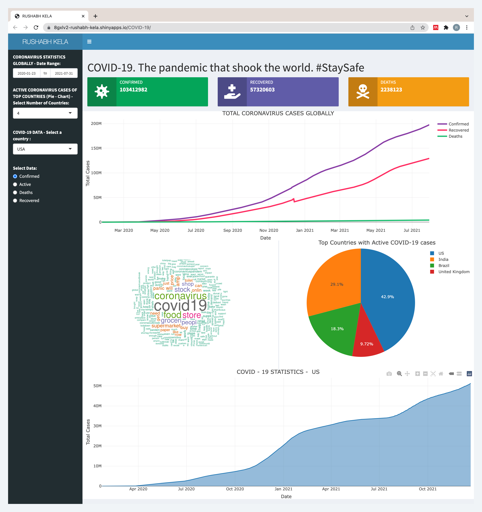

<div id="top"></div>

<br />
<div align="center">
  <a href="https://github.com/rushabhkela/R-Shiny-Dashboard">
    
  </a>

  <h3 align="center">COVID - 19 Dashboard</h3>

  
  <p align="center">
     “A visual display of the most important information needed to achieve
one or more objectives which fits entirely on a single computer screen so
it can be monitored at a glance.”
    <br />
    <a href="https://github.com/rushabhkela/R-Shiny-Dashboard"><strong>Explore the docs »</strong></a>
    <br />
    <br />
    <a href="https://8gxlv2-rushabh-kela.shinyapps.io/COVID-19/">View Demo</a>
    ·
    <a href="https://github.com/rushabhkela/R-Shiny-Dashboard/issues">Report Bug</a>
    ·
    <a href="https://github.com/rushabhkela/R-Shiny-Dashboard/pulls">Request Feature</a>
  </p>
</div>


<!-- TABLE OF CONTENTS -->
<details>
  <summary>Table of Contents</summary>
  <ol>
    <li>
      <a href="#about-the-project">About The Project</a>
      <ul>
        <li><a href="#built-with">Built With</a></li>
      </ul>
    </li>
    <li>
      <a href="#run-the-project">Run the project</a>
    </li>
    <li><a href="#contributing">Contributing</a></li>
    <li><a href="#license">License</a></li>
    <li><a href="#contact">Contact</a></li>
    <li><a href="#acknowledgments">Acknowledgments</a></li>
  </ol>
</details>


<!-- ABOUT THE PROJECT -->
## About The Project



The heading is displayed on the dashboard. Below this there are three
information boxes showing the confirmed, recovered and death cases due to
COVID-19 worldwide.
All the data is fetched from John Hopkins University COVID-19 data and is
updated daily.
* There is a line chart showing the confirmed, recovered and death cases
due to COVID-19 globally with respect to dates. For this, a Date Range
Input provided for user to visualise the chart in a specific date range.
* Coronavirus tweets dataset is used to generate a word cloud to analyse
the terms used with respect to COVID – 19. This is a colourful word
cloud generated with the help of various text mining and text data
visualisation packages.
* A pie chart showing the top countries with highest number of active
COVID-19 cases is displayed beside the word cloud. A dropdown list is
given as input in the sidebar with options of 1 to 10, to visualise the top
1-10 countries as required.
* There is an area chart which displays the information countrywise. I have
added 5 countries to the dropdown list input (India, USA, United
Kingdom, China and France). The user can select the radio button
input according to what he may want to visualise (Confirmed, Active,
Recovered or Death Cases over time for the particular country).
* The graphs are plotted using plotly library to make them more
interactive on the dashboard.

The project consists of two files : 
- ui.R : The ui.R file is used for UI (User Interface) of the dashboard. It controls
the layout and appearance of the dashboard.

- server.R : The server.R file is the backend of the application where the data is
processed and the plots/text are rendered to the output screen. 


<p align="right">(<a href="#top">back to top</a>)</p>


### Built With

This project was built with the following frameworks and technologies:

* [R](https://nodejs.org/en/)
* [RStudio](https://expressjs.com/)
* [Shiny Dashboard](https://www.mongodb.com/)
* [Dataset](https://getbootstrap.com)


<p align="right">(<a href="#top">back to top</a>)</p>


<!-- GETTING STARTED -->
## Run the project

Follow the steps given below to run the project.

1. Clone the repo
   ```sh
   git clone https://github.com/rushabhkela/R-Shiny-Dashboard.git
   ```
2. Open the project using RStudio and install the required R packages.
3. Click on `Run App` to run the project locally on your system.
4. Alternatively, you may directly checkout the [dashboard deployed to ShinyApps.io](https://8gxlv2-rushabh-kela.shinyapps.io/COVID-19/)

 

<p align="right">(<a href="#top">back to top</a>)</p>


<!-- CONTRIBUTING -->
## Contributing

Contributions are what make the open source community such an amazing place to learn, inspire, and create. Any contributions you make are **greatly appreciated**.

If you have a suggestion that would make this better, please fork the repo and create a pull request. You can also simply open an issue with the tag "enhancement".
Don't forget to give the project a star! Thanks again!

1. Fork the Project
2. Create your Feature Branch (`git checkout -b feature/AmazingFeature`)
3. Commit your Changes (`git commit -m 'Add some AmazingFeature'`)
4. Push to the Branch (`git push origin feature/AmazingFeature`)
5. Open a Pull Request

<p align="right">(<a href="#top">back to top</a>)</p>


<!-- LICENSE -->
## License

Distributed under the MIT License. See `LICENSE` for more information.

<p align="right">(<a href="#top">back to top</a>)</p>


<!-- CONTACT -->
## Contact

Rushabh Kela - +91 9834473257 - kelarushabh@gmail.com

Project Link: [https://github.com/rushabhkela/R-Shiny-Dashboard](https://github.com/rushabhkela/R-Shiny-Dashboard)

<p align="right">(<a href="#top">back to top</a>)</p>


<!-- ACKNOWLEDGMENTS -->
## Acknowledgments

* [Dataset Repository](https://github.com/laxmimerit/Covid-19-Preprocessed-Dataset)
* [ShinyApps.io](https://www.shinyapps.io/)

<p align="right">(<a href="#top">back to top</a>)</p>
